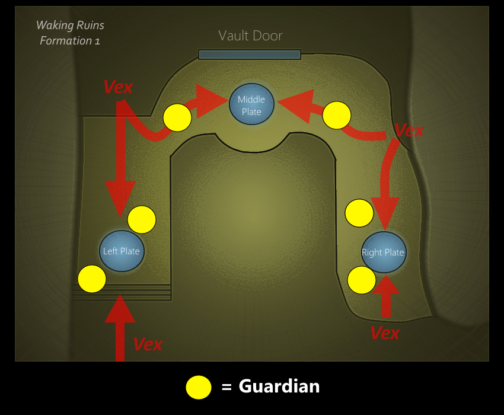
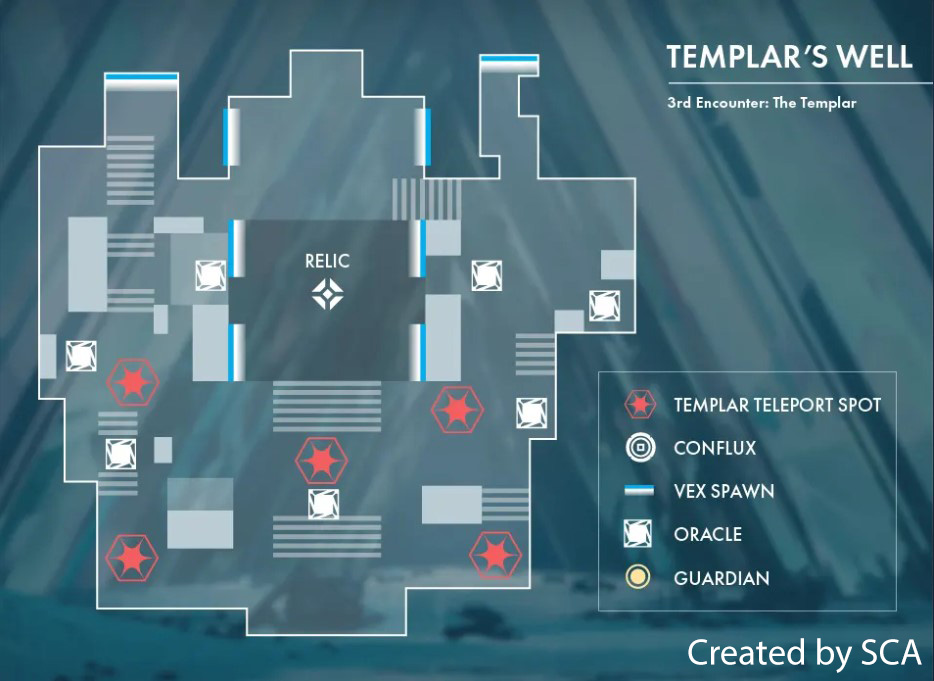
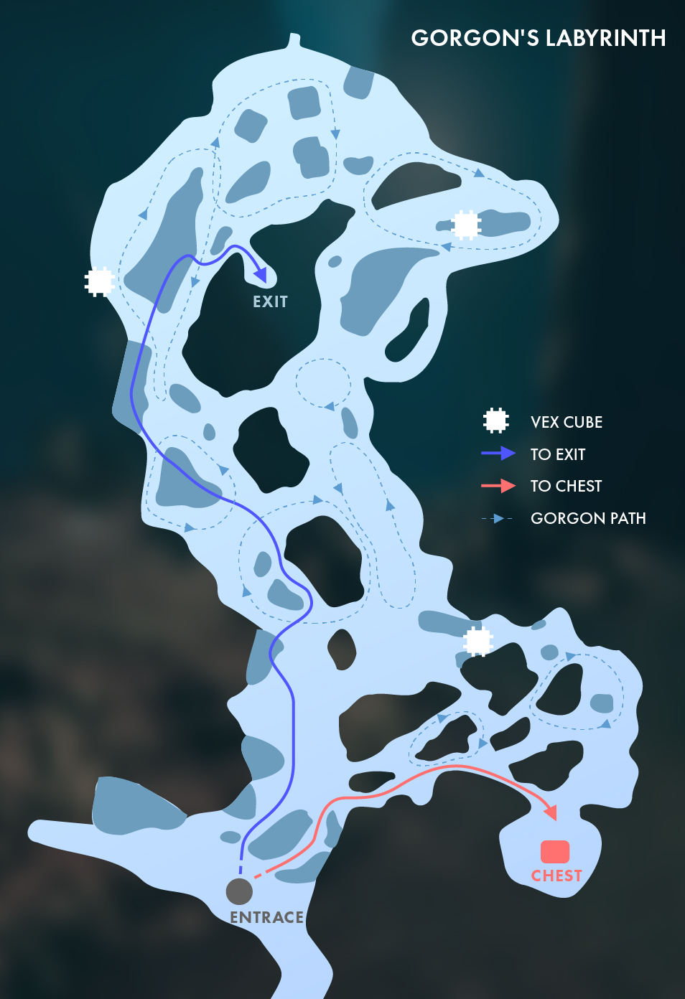
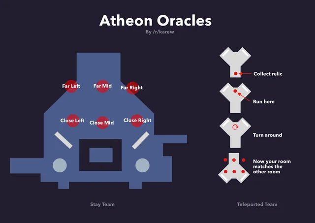
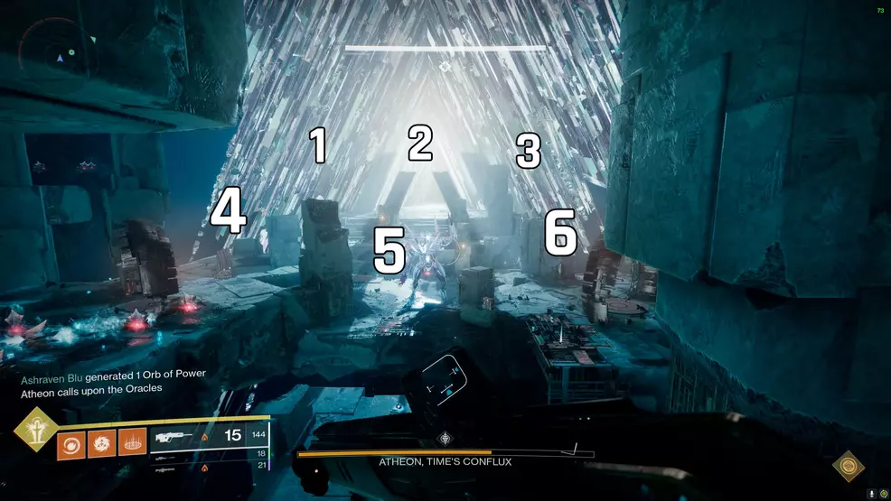

# Vault of Glass
### Opening the Vault

There are three plates that need to be captured to build the spire. Two guardians will go to each plate. The plate needs to be stood on until it is completely charged (there will be text in the bottom left of the screen when it is built. If unsure, just keep standing in it). Defend the plate from vex. Minotaurs will disrupt the plate if not dealt with.

### Defending the confluxes

Confluxes will spawn that need to be defended from vex that attempt to sacrifice themselves. Two guardians will take left, two will take right, and two will take the middle. There are three rounds: conflux in the middle, conflux on either side, and all three confluxes are active.

This encounter is very straightforward. The only mechanic is to avoid the pools of vex milk dropped by the fanatics when they die. If you touch it, you will be “marked for negation” and need to run to the pool in front of the Templar to be cleansed. It is best if you just don’t get marked for negation. Melee builds are not good here.

### Oracles

There are 5 rounds of oracles. The first round three oracles spawn, then four, then five, then six, and finally all seven. The order of the oracles will be shown twice, and then they will spawn. Oracles need to be killed in order.

Spawns are shown below:

Xenophage or a sniper rifle are good for destroying the oracles fast at distance. Three guardians will focus on ad clear, and three will worry about the oracles.

If oracles are destroyed out of order, we will be marked for negation and must all run to the center to be cleansed. We have to step in the cleansing pool at the same time. Someone will count it off.

### Templar

We finally get to kill the templar. The templar is immune until the relic is used to break its shields. After its shields are broken, the Templar will attempt to teleport. If it teleports, it will reset its shield. A teleport can be prevented by standing where the templar is going to teleport.

During the encounter, oracles will spawn like before. If they are not destroyed in order in time, they will mark the entire fireteam to be wiped. The mark can be removed by cleansing guardians with the relic

During the encounter every now and then a random guardian will be selected to be put in a vex cage. Someone else on the team will have to shoot them out..

**Everyone except the relic runner:**  
We will ignore most of the mechanics in this encounter. After rallying, everyone will jump off the edge except the relic runner. When the relic runner calls it out, everyone will respawn and prepare to DPS the templar. Once the Templar’s shield breaks, DPS the boss fast. If the relic runner is put in a cage, someone needs to immediately break them out.

**Relic Runner:**  
Relic runner will pick up the relic and hide until he is marked by the Templar. He will then call out to the rest of the team to respawn, cleanse himself, and pop the Templar’s shield by supering. The relic runner then focuses on preventing Templar teleports.

**DPS:**  
Despite what all the clickbaiting youtube videos say, the specific weapons you use are not as important as stacking buffs and debuffs to get a good damage multiplier. See [this sheet](https://docs.google.com/spreadsheets/d/1i1KUwgVkd8qhwYj481gkV9sZNJQCE-C3Q-dpQutPCi4/edit?gid=2073397587#gid=2073397587) for more info. To get good DPS, we should each have a plan to stack the following:

1. Global debuff on the boss  
2. Empowering buff on yourself  
3. Weapon surges  
4. Amplification modifiers  
5. Weapon perks  
6. World activity buff

I recommend rockets or grenade launchers since the Templar could turn to face the relic runner which makes precision damage difficult. Fusion rifles are also a good option.Our damage buff stacking :

1. Deadfall tether (35% debuff) or one person with particle reconstruction and a fusion rifle (27.6%) \[global debuff\]  
2. Well of radiance (25% buff) \[empowering buff\]  
3. Three weapon surges of the elemental type of your heavy weapon (22%) \[weapon surges\]  
4. Get your weapon stat as high as possible on your armor. (200 stat is a 20% buff to heavy weapons) \[amplification modifier\]  
5. Bait and Switch (35%), Explosive Light (\~25%), or vorpal weapon (20%) are good options \[weapon perk\]  
6. Could be an elemental type or a weapon archetype. (25%) (Looks like there isn’t one for weekly raid)

Solid weapons choices include:

* Gjallahorn  
* Dragon’s breath  
* Edge transit  
* VS chill inhibitor (curated god roll can be picked up for free from banshee in the tower)  
* Hothead (adept) (curated god roll can be picked up for free from banshee in the tower)

If we have a well, deadfall tether, and I use VS chill inhibitor with bait and switch,have 200 weapons stat, and use 3 stasis surges, I will do 334% damage. VS chill inhibitor also has “envious arsenal” which reloads the weapon for you when you do damage with your other two weapons, which also will reset your bait and switch. This does not include other damaging artifact perks like “kinetic impacts”.

Bait and switch is the hardest damage perk to get set up here. If you are not confident, just use the adept hothead with clown cartridge for good DPS.

### Gorgon’s Maze

The Gorgon’s maze is a stealth section. The goal is to make it through to the exit without any member of the fireteam being seen. If someone is seen, the entire team wipes. It is possible to kill a Gorgon, but each time one is killed, all the others become stronger. Ideally we won’t be seen at all.

**Mechanics:**  
One invis hunter should run through and shoot the three vex cubes to open the secret chest. We then will move as a fireteam to the chest. Hunters will run omnioculus and make the entire team invisible to pass the two gorgons on the way.

Once we have the chest, we can wipe and then run the blue path to the exit. Hunters will again make everyone invisible.

### Gatekeeper

This is the throne room, the final room of the raid. There is a portal on either side of the room. When the portals are open, they take you to mirrored versions of the throne. The left portal is Mars and the right portal is Venus. Mars is red and dusty while Venus has lots of greenery.The portals are opened by standing on the plates on either side.

The goal of this encounter is to defend the confluxes from vex minotaurs like before. There is one conflux on Mars, one on Venus, and then later one in the center of the throne room. The minotaurs will have an immunity shield that can only be broken by the relic shield.

Spawn the relic and enable the portals by killing the gatekeeper.

**Portal Openers:**  
One guardian will need to stand on the Venus plate and one will stand on the Mars plate. They will be defending the plate from overload minotaurs to keep the portals open. Occasionally the gatekeeper hydra will spawn again and disable the portals. It needs to be killed as soon as possible to re-open the portals.

**Relic Runners:**  
The relic will need to be moved between the different dimensions. Going through a portal with the relic will give the “teleport destabilized” buff that prevents the guardian from going through a portal again for a time. The relic will need to be juggled by the relic runners.

The other four guardians will be relic runners. One will enter Mars and one will enter Venus. They will call out when they have a minotaur that needs its shield broken. The first relic holder will pick up the relic after the gatekeeper is killed. They will enter the portal with the minotaur, break its shield, and then drop the relic to the other guardian inside the portal. That guardian will then take the relic back to the throne room and drop it to the next relic runner, who will then bring it into the other portal. We continue moving the relic from side to side until the two confluxes disappear.

**The Third Conflux:**  
After six(?) rounds of juggling the relic, the two confluxes in the portals will disappear and a third will appear in the throne room. Everyone moves there and defends the final conflux until a chest appears.

### Atheon: 

Atheon will open the timestream and teleport three guardians to either Mars or Venus. Oracles will appear, but they need to be destroyed in the correct order that only people in the throne room can see. While in either Mars or Venus, a darkness buff will cover your entire screen making it impossible to see unless cleansed with the relic. Once picked up, the relic can not be dropped for more than a few seconds. After all the oracles are destroyed, Atheon becomes vulnerable and after a minute or so will choose a random guardian to give the containment buff.

**Teleported Guardians:**

* Call out whether you are in Mars or Venus  
* One person picks up the relic  
* Kill the hydra  
* Move to the back of the room  
* Relic holder regularly cleanses the team  
* Shoot the oracles in the order called out (eg. front left, back left, middle)  
* After 3 rounds of oracles, exit through the portal  
* Relic holder needs to cleanse the team one last time on the other side of the portal

**Not-teleported Guardians:**

* One guardian goes to the back of the room and watches the order of the oracles and calls them out. They will show the pattern twice before appearing. There are three rounds of this.  
* One guardian opens up the portal to the side the teleported guardians calls out and clears ads  
* The last guardian just clears ads. Focus primarily on ads on the side that the opened portal is on, as we will DPS from that side  
* After the third round of oracles, get in position for DPS

**DPS:**

* Follow the same loadout recommendations from the Templar section  
* One person will get the containment buff and needs to move away from the group. Moving towards Atheon lets the fireteam free you without interrupting DPS too much. IT IS VERY IMPORTANT THIS GUARDIAN SEPARATES THEMSELVES FROM THE GROUP, SO PAY ATTENTION IF YOU HAVE IT.  
* Damage the boss

Oracle callouts:  

Another perspective:  
