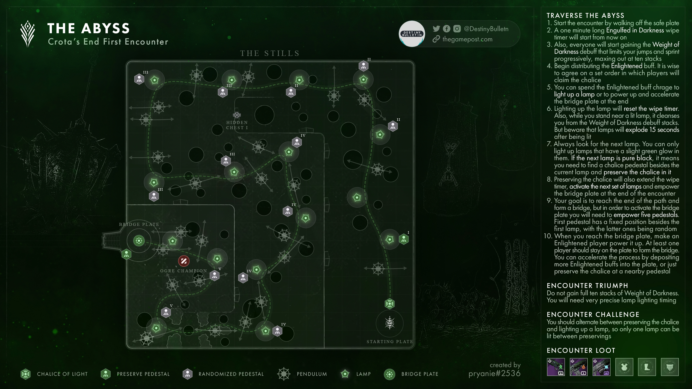

# Crota's End
## Descend Into the Hellmouth
### Mechanics
**Chalice of light:** 
- Claiming the chalice of light gives you the chalice of light buff
- Holding the chalice of light will fill up a buff
- Once the bar is full, a 10 second countdown will start.
- If you still have the chalice of light after those 10 seconds are up, you die.
- Another player can take the chalice from you. If they take it after your bar is filled, but before your 10 seconds expire, you get the enlightened buff

**Enlightened:**
- When you are enlightened, you can interact with different things.
- In the starting area, you can interact with the plate to build the bridge to descend into the Hellmouth.
- The more enlightened players that interact with the plate, the faster it will build.
- After interacting with something, you will lose the enlightened buff and become drained of light.

**Drained of light:**
- Drained of light lasts 45 seconds.
- While you are drained, you cannot pick up the chalice of light.

## The Abyss
### Mechanics

### Encounter Map

## Rick Kackis
<iframe width="560" height="315" src="https://www.youtube.com/embed/gAvFiz1mdZg" title="Destiny 2: CROTA&#39;S END RAID FOR DUMMIES! - Complete Raid Guide &amp; Walkthrough" frameborder="0" allow="accelerometer; autoplay; clipboard-write; encrypted-media; gyroscope; picture-in-picture; web-share" referrerpolicy="strict-origin-when-cross-origin" allowfullscreen></iframe>