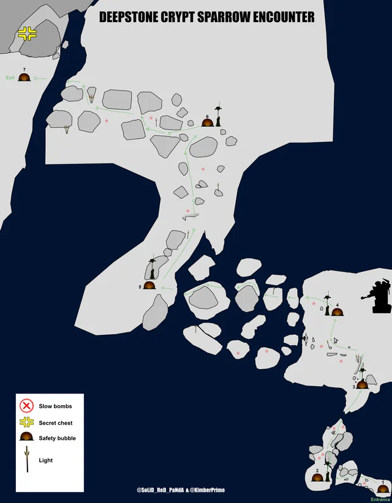
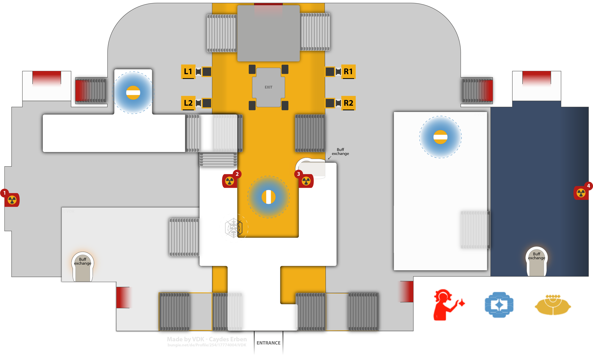
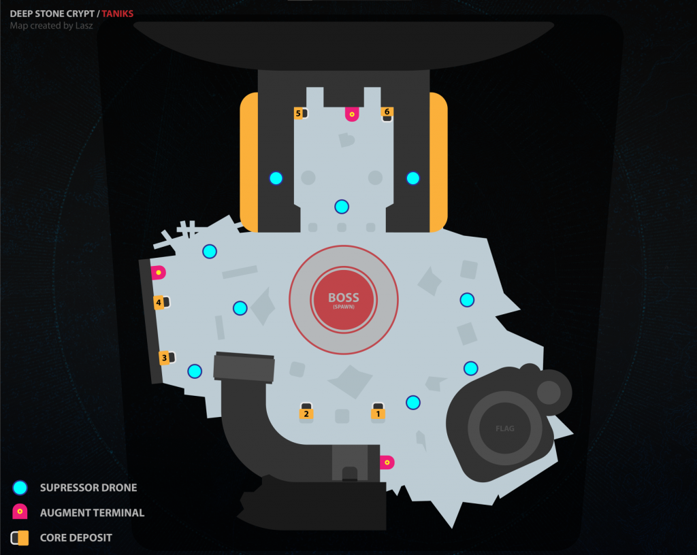

# Deep Stone Crypt
## Chilly Sparrows
It is cold out. If you are outside of the warm bubble shelters, you will collect stacks of a "Frostbite" buff. Each bubble shelter will have fallen ads to clear while you are recovering from the cold.

```admonish danger title="Frostbite"
Getting to 10 stacks of Frostbite kills you.
```

Hop from bubble to bubble, clearing ads as you go. You can follow the lights in game to guide you to the next bubble, or follow this map:

#### Encounter Map


## Disabling Crypt Security
### Layout
There are two sides to this area: a light and a dark side. Once a player claims the operator buff, the encounter begins and the doors that connect the two sides will close. In the center of the two rooms there are six fuses, three on the light side and three on the dark side. There is also a basement area with 10 panels, five on the dark half and five on the light half.

### Mechanics
This encounter deals with juggling an operator and a scanner buff, similar to Vesper's Host. The buffs do not time out and they can be passed around using the terminal. Depositing a buff in one terminal makes it available in all terminals.

There are overload champions in this encounter, be sure to have weapons that stun overloads equipped.

##### Operator
The operator buff enables a player to shoot panels. Shooting the panels by the doors will open the doors that connect the dark and the light side. When only the operator is in the central room, they can shoot the panel that takes them to the basement. In the basement there are 10 panels to shoot. Shooting the correct panels will start damage phase.

```admonish warning title="Basement panels"
Shooting the wrong panel wipes the operator. Wait for the scanner's callout before shooting.
```

##### Scanner
The scanner lets a player see which panels need to be shot as well as which fuse to damage.

##### Servitors
Every once in a while a servitor will spawn that disables the terminals. Kill them quickly.

### Team Breakdown
Half of the team will go to the dark side, and half will go to the light side.

#### Basement Dweller
To start, the basement dweller will pick up the operator buff to start the encounter. The operator will wait until someone else has the scanner buff, and then they will go down to the basement. The scanner will call out which panels the basement dweller needs to shoot. There should be two on either side. When all four are hit, the basement dweller will deposit the operator buff in the terminal in the basement and then wait for the scanner buff to become available. Once they get the scanner buff, they will run around the central terminal and call out which fuse to shoot (dark left, dark middle, dark right, light left, light middle, or light right) until either all six fuses are destroyed or damage phase ends. Once it ends, the basement dweller will rotate back to the top.

#### Top Dogs
Players staying up top on either the light or the dark side will have roughly the same job. They will clear ads, prioritizing the servitors. Once the scanner vandal spawns, they kill it and pick up the buff. The scanner looks through the windows in the floor to identify the two glowing panels on their side. Once they call both of them out (or type it into game chat), they deposit the scanner buff in the terminal. A player on the opposite side will then pick the scanner buff up and call out their two panels. The operator will then shoot those panels in the basement and deposit the operator buff. A player upstairs needs to pick up the operator buff from the terminal so that the scanner can deposit their buff to send it to the basement. The guardian in the basement will then call out which fuse to shoot. All players should be shooting fuses.

```admonish warning title="Fuses"
Hitting the wrong fuse wipes the team. Only shoot the fuse that's been called out.
```

Once all six fuses are destroyed, the encounter is over. If we aren't able to one-phase the fuses, then the player with the operator buff will open the door to let the basement player back up, and the operator will then rotate down to do the basement player's role.

#### Encounter Map


## Atraks-1, the Fallen Exo
### Mechanics
We will be attemt the one-phase. Doing this skips a lot of mechanics and makes it very straightforward. Everyone should have Parasite equipped and a burst damage super (hunters use blade barrage, titans use thundercrash, and warlocks use nova bomb). The damage phase is very short.

When all of the Atraks starts glowing white, the guardian with the scanner buff needs to identify which Atraks is the one to kill. As soon as anyone does damage, the timer to do damage starts ticking down.

```admonish important title="Damage timing"
Everyone must start damage at exactly the same time. Wait for someone to count it out before you shoot.
```

### Team Breakdown
##### Basement Dwellers
Two guardians will hang out downstairs. Their job is to clear ads and get their parasite stacks to x20. They will kill all three servitors and then head up to join the guardians in space.

##### Top Dogs
The rest of the fireteam heads upstairs. If a player with an operator buff goes to space, be sure to send some pods back to the ground for the rest of the team to join you. Everyone needs to get their parasite stacks to x20. Kill 2/3 servitors, but wait until the guardians down below join you to kill the last one.

##### All Together
Once everyone is upstairs and has x20 parasite stacks, kill the last servitor. The scanner will then identify the Atraks to dps and call it out. Everyone gather around and wait for the countdown. Once it is time, everyone drop their parasite and half the team should use their super. If this doesn't get us to the damage gate, wipe and try again.

Atraks will reset and start doing his wipe mechanic again. The scanner needs to call out which one to damage, and once again all guardians will damage that Atraks at the same time, with the rest of the supers being used.

## Taniks, Reborn - Rapture

### Mechanics
In this encounter there are three buffs: scanner, operator, and suppressor. The goal is to collect nuclear cores and deposit them in the correct bucket. Holding a nuclear core gives you a radiation buff. Pass the nuclear core onto a different guardian or deposit it in the correct bucket to get rid of your radiation buff.

```admonish danger title="Radiation"
Radiation x10 kills you. Don't hold a nuclear core too long.
```

After each round of depositing cores, one players buff will become disabled. They need to deposit it in the terminal, and another player will need to pick it up and rotate into their role.

Once enough cores have been deposited, the middle floor will open and everyone must enter it and race to the end. If you are too slow, Taniks will catch you and do mean things to you.

### Team Breakdown

##### Scanner
Scanner picks up the scanner buff. They will call out which two buckets nuclear cores should be deposited into. Scanner can also pick up cores and deposit them.

##### Operator
Operator picks up the operator buff. They will shoot panels to release nuclear cores. They can also pick up the nuclear cores and deposit them.

##### Suppressor
Suppressor picks up the suppressor buff. Before the nuclear cores can be deposited, the suppressor needs to stun Taniks. They can do this by shooting him from each of the three drones.

##### Everyone else
Clear ads, help juggle and deposit the nuclear cores, and be ready to switch into any of the other roles once a buff is disabled.

#### Encounter Map


## Taniks, the Abomination
### Mechanics
This encounter is basically the same as the last encounter, except depositing four nuclear cores starts a damage phase, the area is larger, and the operator's role is slightly different.

Instead of the operator spawning the nuclear cores, everyone can spawn the nuclear cores by shooting Tanik's wings.

The operator now shoots trapped nuclear core carriers to release them.

For damage, there will be two rings around Taniks. Stand inside the outer ring, but outside the inner ring. Once you get him low enough, he enters an enrage phase. In his enrage he teleports around the arena. Chase him down and do DPS.

```admonish warning title="Damage check"
This is a hard damage check. Not enough DPS in the phase wipes the team.
```

#### Encounter Map


## Rick Kackis
<iframe width="560" height="315" src="https://www.youtube.com/embed/05vQIHhBmr4" title="Destiny 2: DEEP STONE CRYPT RAID FOR DUMMIES! | Complete Raid Guide &amp; Walkthrough!" frameborder="0" allow="accelerometer; autoplay; clipboard-write; encrypted-media; gyroscope; picture-in-picture; web-share" referrerpolicy="strict-origin-when-cross-origin" allowfullscreen></iframe>