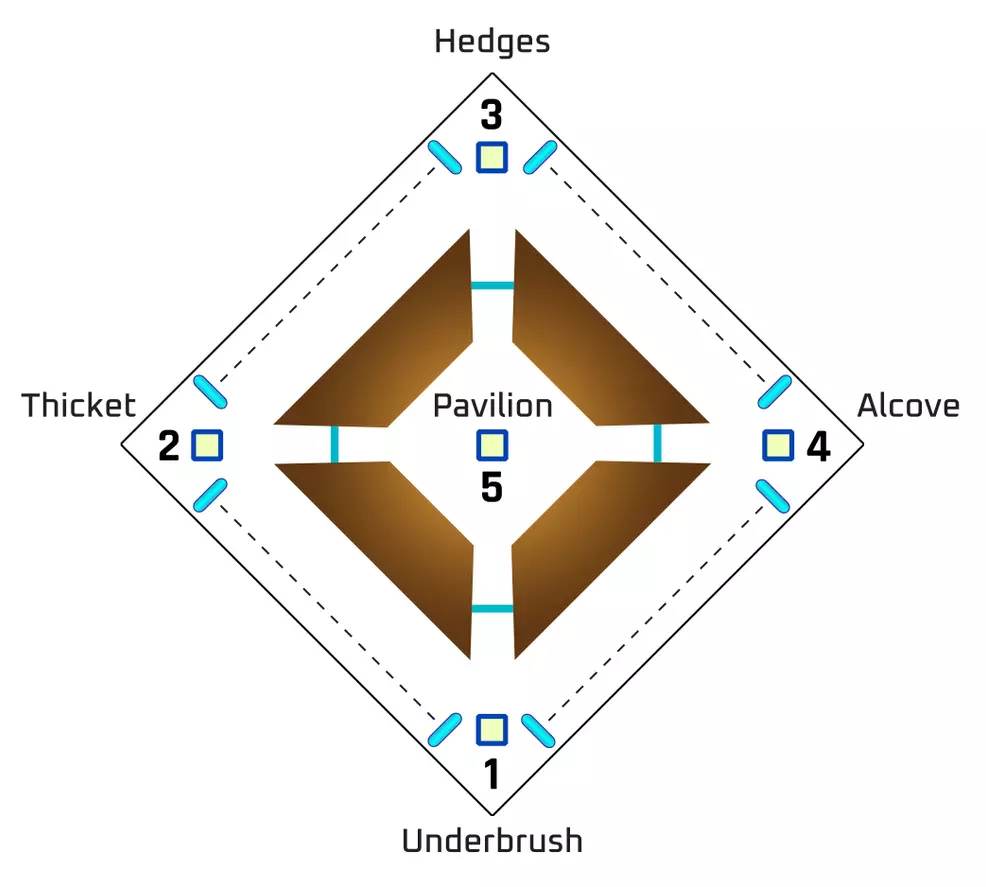

# Garden of Salvation
## First Encounter: Embrace

Split into two teams of three.

**Team with boss:**

* Kill Ads  
* Stay alive  
* Alternate picking up the spit. If no one can pick up the spit, someone with the voltaic overflow buff can pick it up and be revived.

**Team without boss:**

* Clear ads  
* Make sure everyone has overload  
* Kill angelic hydra  
* Connect chain to door

Play leapfrog until the encounter is completed. Follow the boss along the ridge picking up spit as you go. Kill cyclopes to survive. Rockets, void resist, and concussive dampener may help survivability here

## Second Encounter: Undergrowth

* One guardian on each conflux to defend them.  
* One guardian alternates between 1 and 2  
* One guardian alternates between 3 and 4

**Mechanics:**

* Single guardians call out angelics.  
* Floaters rotate over to the angelic to help kill it  
* Once angelic is killed, they tether to the conflux to give the enlightened buff

## Third Encounter: Consecrated Mind

Once again split into two teams of three

**Mote Collectors:**

* kill Minotaurs to collect motes. A single guardian should collect motes at a time.  
* Once a guardian has 10 motes, deposit in the bank. They will get the enlightened buff and should focus on breaking shields  
* The next guardian should then start collecting  
* Once 30 motes are deposited, damage phase starts.

**Spit Collectors:**

* Follow consecrated mind  
* Alternate collecting spit  
* Whoever collects spit, calls out whether the inner or outer eyes are glowing  
* Fireteam shoots the three eyes. DONT USE SNIPER

If all three spit collectors have the buff, they will need to rotate one person out with the more collectors.

For DPS, follow the boss down the hall as you damage to ensure you don’t get stuck behind the wall

## Fourth Encounter: Sanctified Mind

Split into three teams of two. Two teams are “mote collectors” and one team is “builders”

1. Clear ads  
2. Shoot the knee or shoulder to open a portal  
3. Two guardians enter and collect motes. Once they are done, shoot the same knee/shoulder to bring them back and send the next two through.  
4. Repeat until 30 motes are deposited, then do the same on the other side  
5. Boss will show either a blue or orange plus sign. Connect the tether to the corresponding bank  
6. As soon as the tether is connected, the other side should connect their tether  
7. Damage phase

When a guardian deposits motes, their main goal should then be to clear the shields because they will have the enlightened buff.

## Rick Kackis
<iframe width="560" height="315" src="https://www.youtube.com/embed/froVY9nlLCc" title="Destiny 2: GARDEN OF SALVATION RAID FOR DUMMIES! | Complete Raid Guide &amp; Walkthrough!" frameborder="0" allow="accelerometer; autoplay; clipboard-write; encrypted-media; gyroscope; picture-in-picture; web-share" referrerpolicy="strict-origin-when-cross-origin" allowfullscreen></iframe>