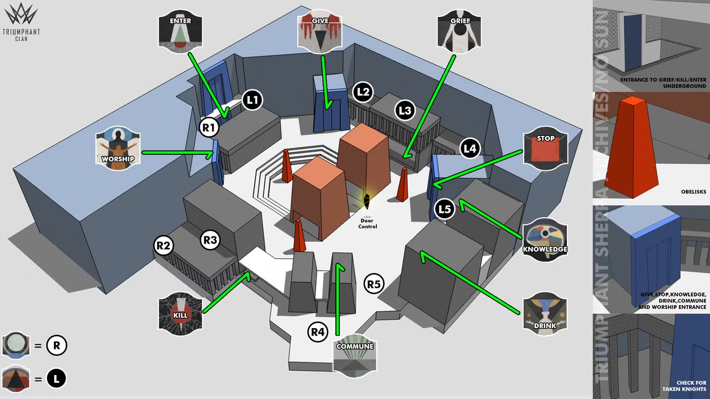
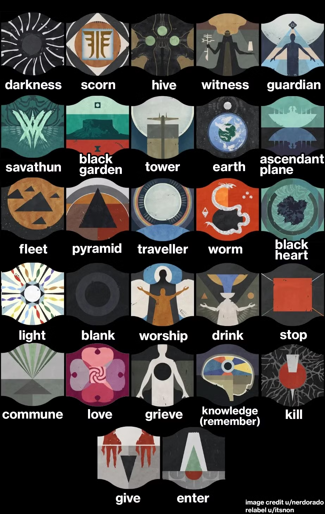
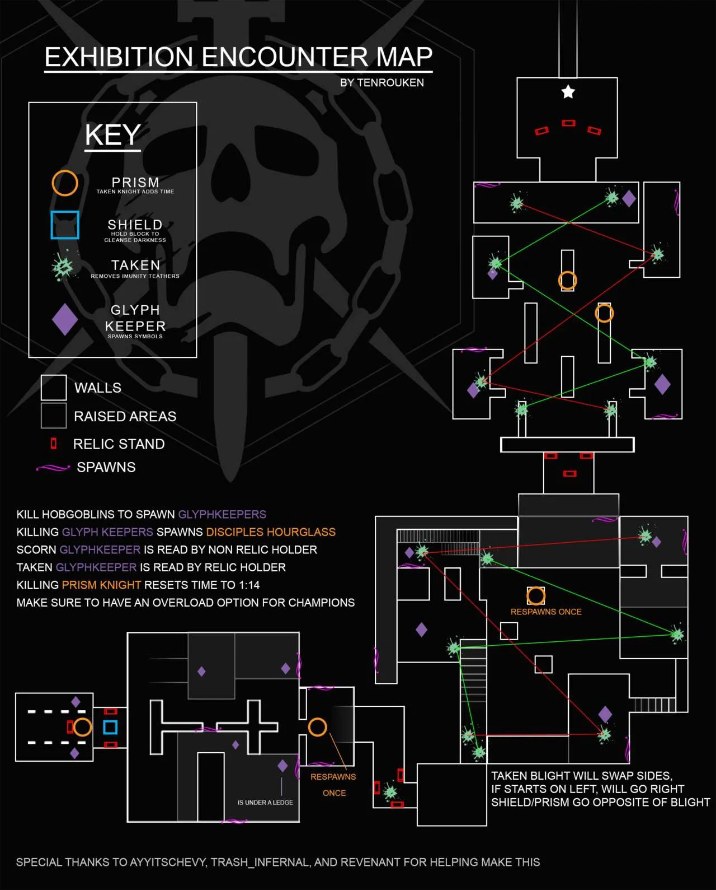
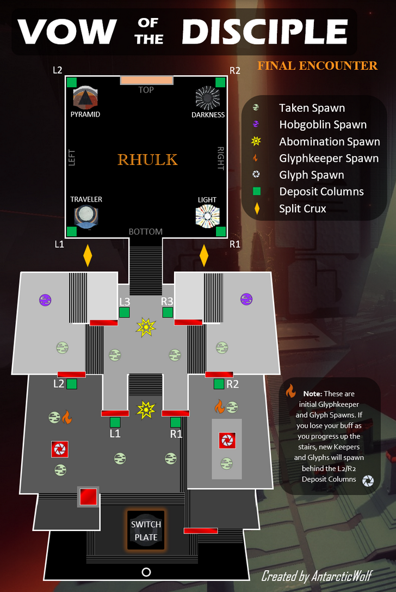

# Vow of the Disciple
## Entering the Raid:

First, kill Savanathun’s memory to open the door. Once inside, you will enter the bog where you have to deliver a big black package. In each section, there are 9 cruxes. You can hold up to three at a time. The team needs to collect all 10 and deposit them in the package. When you are not next to the big black package, you will gain stacks of pervading darkness. Don’t let it stack to x10 or you will die. Either collect cruxes or ad clear.

## Acquisition:

First, familiarize yourself with these symbols and their names. Note that some members of the fireteam may still use our day-one callouts, which are not the correct names.

These symbols will be important throughout the entire raid. The room layout is this:

We will split up into three teams of two, with each team defending one of the red obelisks. Each obelisk has a spot for three symbols on it:

1. Traveler or Pyramid \- this is the location of the taken knight that must be killed to reveal the next symbol. Traveler means the knight will be at R1, R2, R3, R4, or R5. Pyramid means it will be at L1, L2, L3, L4, or L5.  
2.  Door symbol \- this symbol corresponds to the door that needs to be entered. Once the room has been entered, the last symbol will be revealed.  
3. Light or dark \- in the room from the previous symbol there will be a glyph keeper on the light side and another on the dark side. Kill the one that corresponds to this symbol, and write the symbol in chat.

After completing all three pillars (killing the knight, entering the door, killing the correct glyphkeeper, and noting the symbol) you will have three symbols. Each pillar you have been protecting has 9 symbols on it. Find the pillar that contains your 3 symbols and call it out when you’ve found it. All three symbols need to be shot at the same time for your offering to be accepted.

### Additional Mechanics

1. If the pillar gets shot too many times by ads, the whole team wipes.  
2. Unstoppable champions will spawn every once in a while while defending the pillar. Be sure to have some way to deal with them.  
3. Anti-barrier is helpful for the scorn with the stupid little shield that somehow blocks 90% of my shots.  
4. Only half of the doors will be open at a time. Shooting the crystal floating in the middle of the room (marked as “door control” on the map) will switch which doors are open.

### Teams:

There will be three teams of two:

* Team one  
  * Covers the worship, enter, and give doors  
  * Covers knight spawns R1, L1, and L2  
* Team two  
  * Covers grief, knowledge, and stop doors  
  * Covers knight spawns L3, L4, and L5  
* Team three   
  * Covers kill, commune (volcano), and drink doors  
  * Covers knight spawns R2, R3, R4, and R5

## Caretaker

### Teams

Recommend pulse rifle with anti barrier to clear ads at a distance and to be able to hit the snipers when they put up their shield. There will also be overload champions. We will split up into three teams of two:

* Team 1 \- Ad clear  
  * Protect the pillar  
  * Clear ads  
  * Help shoot bees  
  * Stay alive  
* Team 2 \- Stunners  
  * One stands in front of Caretaker and the other behind. Getting close to Caretaker makes him slam which opens up his face. Shooting his face opens his back. Shooting his back stuns him.  
  * Shoot bees and clear ads between stuns.  
  * Repeat until runners are done.   
* Team 3 \- Runners  
  * Shoot crux to open door  
  * One person enters and collects up to three of the symbols. Remember the symbols you collect. The higher floors will be more spaced out and have holes you can fall in. Wizards also will blast you while you’re in here. The longer you are in here, the more stacks of pervading darkness you’ll get. Be fast and call out when you need the door opened.  
  * The other runner will shoot the crux again to open it.   
  * On the outside, the runner will call out the three symbols collected and they will both need to shoot those symbols on the pillar. The next runner will then run in. Once 9 symbols are collected and shot on the pillar, damage phase begins

### Damage phase

On each floor there are three plates. You must stand on an active plate to do damage. The side that Caretaker comes up is the side the first plate will activate. After a certain amount of time, the next plate will activate and you’ll need to move to it to continue doing damage.

On the fourth floor, damage phase starts without any other mechanics. If you don’t kill Caretaker before the last plate deactivates, the team wipes

## Exhibition

The bane of our vow runs in the past

### Mechanics

There are three relics that everyone needs to be familiar with:

1. Darkness Laser \- used to kill taken knights  
2. Templar Shield \- used for cleansing stacks of darkness  
3. Eye of Riven \- used to destroy taken orbs

Other important mechanics:

* There are four rooms that we need to move through.  
* Glyphkeepers spawn after hobgoblins are killed  
* Killing Glyphkeepers reveals three symbols  
* Relic holders (of all relics) can see the symbols of taken glyphkeepers. Non-relic holders can see the symbols of scorn glyphkeepers.  
* There will be one symbol that is present in both the scorn glyphs and the taken glyphs.  
* To open the first door, you need to shoot the symbol that was present on both glyphkeepers.  
* For the next 3 doors, you will need to kill 2 sets of glyphkeepers and shoot 2 symbols to open them.  
* There are overload champions in this section.  
* After holding a relic, you cannot pick up another one for 30 seconds, so we need to alternate the relic holders between each room  
* A pervading darkness buff with a 1:15 countdown starts at the beginning of each room. If it hits zero, we wipe. The buff is stopped by depositing all relics in the next room.  
* The buff timer can be reset to 1:14 by killing taken knights

## Rhulk
The boss fight for Rhulk can be broken up into three parts:
1. Getting to Rhulk
1. Weakening Rhulk
1. Damaging Rhulk

We will once again be using all the symbols we have been using throughout the entire raid.

### Getting to Rhulk
There will be a forcefield that prevents you from approaching Rhulk. We will be splitting up into two teams of two. The other two guardians will have a specialized job. 

#### Team One - Ad Clear
The first team of two is just ad clear. Most of the ads we need to clear will be at range, so submachine guns and glaives are probably not be the way to go here. Prioritize killing glyphkeepers as soon as they spawn. There will be one on each side.

Rhulk will charge up blasts and shoot either on the left, the right, or the center. Avoid these blasts, they do a decent amount of damage.

#### Team Two - Runners
Team two are runners. There job is to get the emanating force buff and then deposit into the two called out pillars at the same time. To get the emanating force buff, you must first get the leeching force buff. You will get this by shooting the crystal on the right side when you hear the "split" callout or the "second split" callout. Once you have leeching force, you can upgrade it to emanating force by jumping into Rhulk's laser beam when he shoots it. With Emanating you can pass the forcefield. Once both runners have emanating, two pillars will be called out (eg L1, R3). Each runner will go to a pillar and deposit at the same time. Right after depositing, we will split the buffs again and repeat the process two more times.

#### Team Three - Pillar Caller
Team three is a single guardian. When the glyphkeepers are killed, they reveal three symbols each. One set of symbols can only be seen by guardians without the leeching force buff, and the other can only be seen by guardians with it. The buff holder and the pillar caller will call out their symbols. Just like in the Exhibition encounter, the symbol contained in both sets is the one we are looking for. The Pillar Caller always shoots the left crystal on the "split" callout, and then goes to the center plate and calls out "second split" to give the buff to a runner.

After second split, the pillar caller should down at the six pillars and call out which two contain the correct symbol for the runners to deposit at.

#### Team Four - Buff Holder
The buff holder has an easy job. Once the encounter starts, they shoot the crystal above Rhulk to get the Leeching buff. They then stand on the plate and call out "first split". When "second split" is called out, they shoot the buff on the left. When both glyphkeepers are dead, they call out the symbols they see. They can then just clear ads and avoid Rhulk's laser. After the runners dunk, the buff holder should be standing on the plate and call out "first split" to restart their cycle.

### Damaging Rhulk
#### Glaive Shooter
The glaive shooter's job is to shoot Rhulk's glaive. This will once again give them the Leeching force buff. They then need to jump into Rhulk's laser beam to get the emanating force buff. Someone will callout where they need to deposit this buff.

#### Non-glaive shooters
Do not shoot the glaive. Call out the location to dunk when the symbol appears. When Rhulk's weak spots appear, shoot them. Don't shoot the glaive. Clear ads

#### All
After all of Rhulk's 4 weak spots are broken, damage phase begins. Kill Rhulk until he is immune. Once damage is over, run back to the plate where the Rhulk encounter began. If you don't get there in time, Rhulk's forcefield will shoot you off the edge.

## Rick Kackis
<iframe width="560" height="315" src="https://www.youtube.com/embed/EfXNilL34DU" title="Destiny 2: VOW OF THE DISCIPLE RAID FOR DUMMIES! | Complete Raid Guide &amp; Walkthrough!" frameborder="0" allow="accelerometer; autoplay; clipboard-write; encrypted-media; gyroscope; picture-in-picture; web-share" referrerpolicy="strict-origin-when-cross-origin" allowfullscreen></iframe>